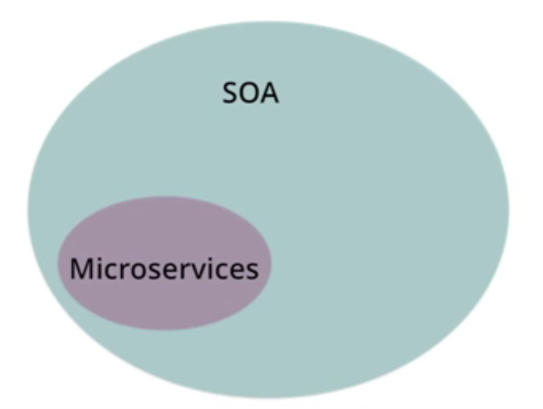

# behnam hajian

## 简介

当前就职于 IBM Watson Data Platform-Private cloud，曾经就职于 Ericsson, Halogen Software。

这里有一个他的自我介绍的blog：

http://www.imotif.net/index.php/2016/08/14/behnam-hajian/

个人信息：

- 个人网站： http://www.imotif.net/
- linkedin： https://www.linkedin.com/in/behnam-hajian-91484314

## 内容

### blog：Microservice

这个 blog 是偶尔发现的，感觉像是某个ppt的文字内容。我很认可他开头写的这句话：

	Microservice is often described as a subset of SOA and is more referred to as a style of organizing development teams rather than a technology thing.

访问地址：

http://www.imotif.net/index.php/2016/10/06/microservice/

### blog：SOA (Service Oriented Architecture)

难得一见的SOA介绍文章，对微服务的理解很有帮助。

访问地址：

http://www.imotif.net/index.php/2016/10/14/soa-service-oriented-architecture/

> TODO： 没有发现这几个文章的中文版本，如果有空尝试翻译一下。