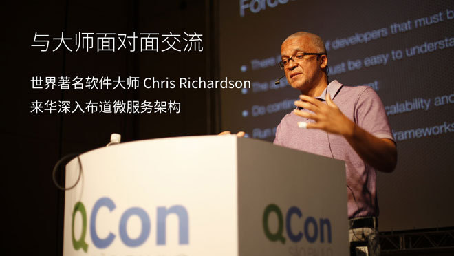

# Chris Richardson

## 简介

Chris Richardson，是世界著名的软件大师，经典技术著作《POJOS IN ACTION》一书的作者，也是 cloudfoundry.com 最初的创始人，他的研究领域包括 Spring、Scala、微服务架构设计、NoSQL 数据库、分布式数据管理、事件驱动的应用编程等。

他是网站 [microservices.io](http://microservices.io) 的创始人，这个网站描述如何开发和部署微服务。另外还有网站 [eventuate.io](http://eventuate.io)，用于微服务部署的应用平台。

Chris 与家人居住在美国加州奥克兰市的海滨小镇，他定期为企业提供微服务设计培训和实战项目的架构咨询服务。

- Blog: http://plainoldobjects.com/
- Twitter: @crichardson
- eventuate.io： http://eventuate.io/
- microservices.io： http://microservices.io

## 交流

Chris 定期为企业提供微服务设计培训和实战项目的架构咨询服务。近年来 Chris 多次访问中国，为包括华为、SAP、惠普、东风汽车等大型企业提供微服务架构相关的技术咨询服务。

- [与大师面对面交流：Chris Richardson 来华布道微服务架构](https://segmentfault.com/e/1160000004557166)

## 内容

### presentations

http://microservices.io/presentations/index.html